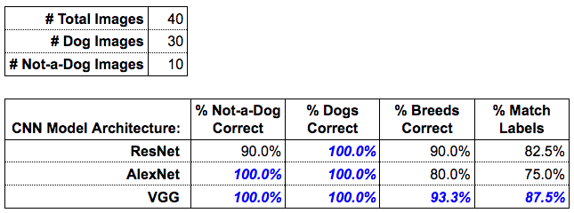

# Dogs Breeds Classifier Project

The project uses a pre-trained classifier to identify dogs breeds, the project support three main models VGG, AlexNet and ReseNet and gives a comparative statistics about their performance.


## Prerequisites

To setup the project you will need to install these packages

```
python3
torch
torchvision
PIL
```

## Usage

You can run the project from the command line using the following:

**ReseNet:**
```
python check_images.py --dir uploaded_images/ --arch resnet  --dogfile dognames.txt
```
**AlexNet:**
```
python check_images.py --dir uploaded_images/ --arch alexnet --dogfile dognames.txt
```
**VGG:**
```
python check_images.py --dir uploaded_images/ --arch vgg  --dogfile dognames.txt

```

in order to the run the three above command and save their results into a files use the script `run_models_batch.sh`:

``` 
bash ./run_models_batch.sh
```

## Results

After executing the project you should get the below results:




